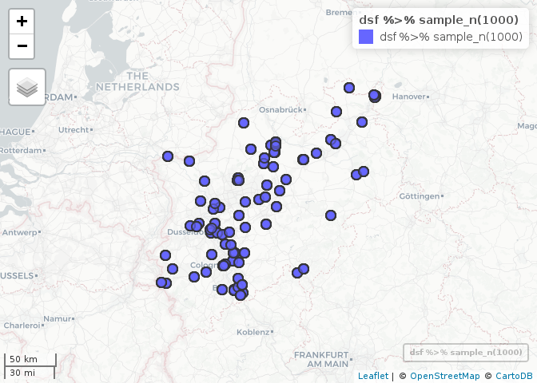
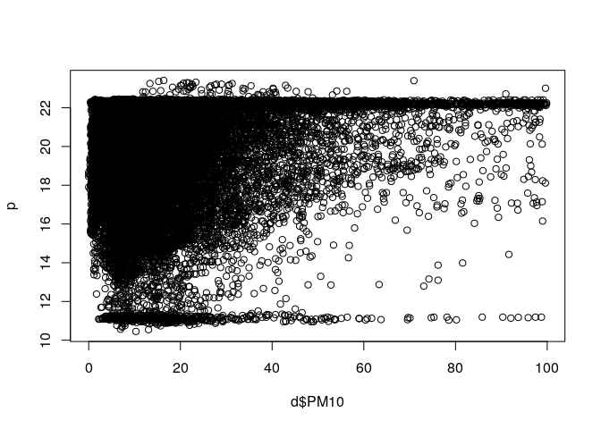

<!-- README.md is generated from README.Rmd. Please edit that file -->

# AQPrediction

<!-- badges: start -->

<!-- badges: end -->

The goal of this repo is to demonstrate spatio-temporal prediction
models to estimate levels of air pollution.

The input dataset is an Excel
[file](https://drive.google.com/open?id=14GvlMCBLR9FQ_BsCeg0tj-pb1AadXr3G3gKPnrfm8gg)
provided as part of the [OpenGeoHub Summer
School 2019](https://opengeohub.org/summer_school_2019).

We’ll use these packages

``` r
suppressPackageStartupMessages({
  library(dplyr)
  library(sf)
})
```

And read-in the input data as follows

``` r
train = readxl::read_excel("SpatialPrediction.xlsx", sheet = 1)
covar = readxl::read_excel("SpatialPrediction.xlsx", sheet = 2)
locat = readxl::read_excel("SpatialPrediction.xlsx", sheet = 3)
# times = readxl::read_excel("SpatialPrediction.xlsx", sheet = 4) # what is this?
targt = readxl::read_excel("SpatialPrediction.xlsx", sheet = 5)
```

The objective is to fill the NA values in the `targt` data:

``` r
targt[1:3]
#> # A tibble: 5,004 x 3
#>    id                       time                PM10 
#>    <chr>                    <dttm>              <lgl>
#>  1 5a5da3c80aa2a900127f895a 2019-04-06 18:00:00 NA   
#>  2 590752d15ba9e500112b21db 2019-04-09 06:00:00 NA   
#>  3 5a58cb80999d43001b7c4ecb 2019-04-03 22:00:00 NA   
#>  4 5a5da3c80aa2a900127f895a 2019-04-03 00:00:00 NA   
#>  5 5a636a22411a790019bdcafd 2019-04-07 10:00:00 NA   
#>  6 5c49b10c35acab0019e6ce19 2019-04-03 16:00:00 NA   
#>  7 5a1b3c7d19991f0011b83054 2019-04-14 04:00:00 NA   
#>  8 5c57147435809500190ef1fd 2019-04-06 12:00:00 NA   
#>  9 5978e8fbfe1c74001199fa2a 2019-04-06 07:00:00 NA   
#> 10 5909d039dd09cc001199a6bf 2019-04-09 15:00:00 NA   
#> # … with 4,994 more rows
```

Let’s do some data cleaning and plot the data:

``` r
d = inner_join(train, covar)
#> Joining, by = c("id", "time")
d = inner_join(d, locat)
#> Joining, by = "id"
dsf = sf::st_as_sf(d, coords = c("X", "Y"), crs = 4326)
summary(dsf)
#>       id                 time                          PM10      
#>  Length:23719       Min.   :2019-04-01 00:00:00   Min.   : 0.00  
#>  Class :character   1st Qu.:2019-04-03 21:00:00   1st Qu.: 8.75  
#>  Mode  :character   Median :2019-04-06 19:00:00   Median :14.97  
#>                     Mean   :2019-04-07 12:57:52   Mean   :19.78  
#>                     3rd Qu.:2019-04-11 07:00:00   3rd Qu.:25.25  
#>                     Max.   :2019-04-14 23:00:00   Max.   :99.87  
#>     humidity       temperature                geometry    
#>  Min.   :  0.00   Min.   :-140.760   POINT        :23719  
#>  1st Qu.: 60.70   1st Qu.:   6.480   epsg:4326    :    0  
#>  Median : 87.65   Median :   9.100   +proj=long...:    0  
#>  Mean   : 77.98   Mean   :   8.051                        
#>  3rd Qu.: 99.90   3rd Qu.:  12.688                        
#>  Max.   :100.00   Max.   :  50.000
mapview::mapview(dsf %>% sample_n(1000))
```

<!-- -->

A simple model:

``` r
m = lm(PM10 ~ humidity + temperature, data = d)
p = predict(object = m, newdata = d)
plot(d$PM10, p)
```

<!-- -->

``` r
cor(d$PM10, p)^2
#> [1] 0.02936257
```

A simple linear model can explain ~3% of the variability in PM10 levels,
not great\!
